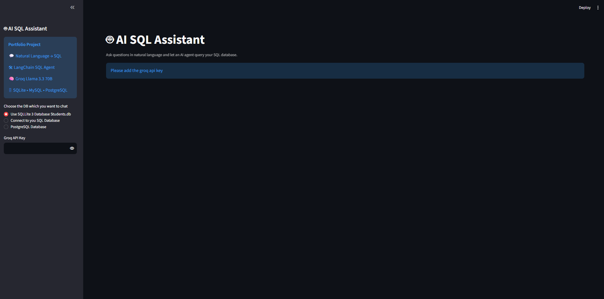
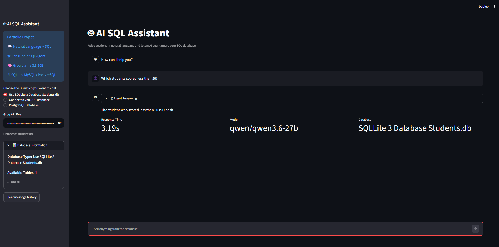
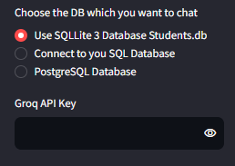
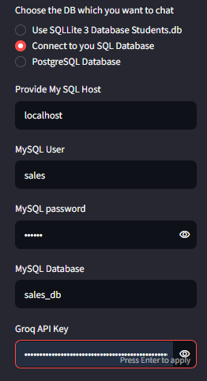
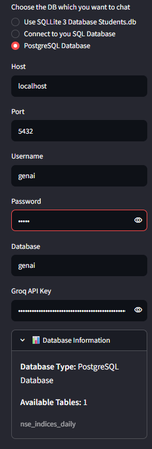
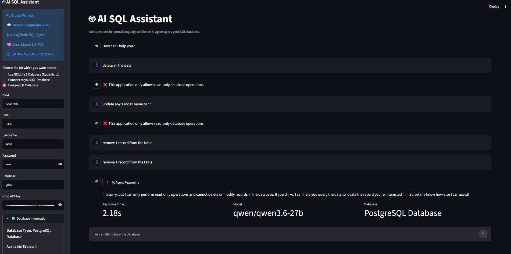

# 🤖 AI SQL Assistant

> A production-inspired Generative AI SQL Assistant that converts natural language into safe, read-only SQL queries using Large Language Models.

## 🎥 Demo

> 🚧 Demo GIF coming soon.

<p align="center">
  
</p>

## Overview
This portfolio project demonstrates practical GenAI engineering by combining LLMs, SQL agents, and database connectivity into an interactive Streamlit application.

### Highlights
- Natural Language → SQL
- LangChain SQL Agent
- Groq-hosted LLM (Qwen 3.6 27B configurable)
- SQLite, MySQL and PostgreSQL support
- Read-only SQL enforcement
- Prompt guardrails
- Input validation against destructive operations
- Streaming LLM responses
- Database schema discovery
- Interactive chat interface
- Response time metrics
- Modular architecture

## Tech Stack
- Python
- Streamlit
- LangChain
- Groq
- SQLAlchemy
- SQLite
- MySQL
- PostgreSQL (psycopg)
- Regex Guardrails

## Features
| Feature | Status |
|---|---|
| Natural language querying | ✅ |
| Multi-database support | ✅ |
| Tool-calling SQL Agent | ✅ |
| Read-only protection | ✅ |
| Schema discovery | ✅ |
| Chat history (session) | ✅ |
| Streaming responses | ✅ |
| Performance metrics | ✅ |
| Database information panel | ✅ |

### Chat Interface


### Database Selection





## Security
- Blocks destructive requests before reaching the LLM.
- Prompt instructs the model to generate only SELECT queries.
- SQLite opened in read-only mode.
- Prevents schema modifications and DML statements.


### SQL Guardrails


## Architecture
```text
User
 │
 ▼
Streamlit UI
 │
 ▼
Validation Guardrails
 │
 ▼
LangChain SQL Agent
 │
 ▼
Groq LLM
 │
 ▼
SQLAlchemy
 │
 ├── SQLite
 ├── MySQL
 └── PostgreSQL
```

## Project Structure
```text
app.py
student.db
requirements.txt
README.md
```

## Installation
```bash
git clone <repo>
cd <repo>
pip install -r requirements.txt
streamlit run app.py
```

## Why this project?
This application showcases practical GenAI engineering skills including LLM integration, agentic workflows, prompt engineering, SQL safety, multi-database connectivity, caching, UI development, and production-oriented guardrails.

## Future Improvements
- Generated SQL viewer
- Result table
- CSV download
- Row count
- Query history
- Authentication
- Docker
- Observability
- Unit tests

## License
MIT
